# Инструменты автоматизации

Использование инструментов автоматизации для провизии узлов.

## Contents

1.[Chapter I](#chapter-i) \
2.[Chapter II](#chapter-i) \
   1.1. [Удаленное конфигурирование узла через Ansible](#part-1-удаленное-конфигурирование-узла-через-ansible) \
   1.2. [Service Discovery](#part-2-service-discovery) 

## Chapter I
Проект состоит из двух частей: 
1. В первой части предстоит осуществить удаленную настройку узла для разворачивания мультисервисного приложения (директория `service`). 
2. Во второй главе предстоит cымитировать два удаленных сервиса - `api` и `БД`, и осуществить между ними подключение через `Service Discovery` с использованием `Consul`.

В результате первой части необходимо реализовать `Ansible-playbook` для разворачивания микросервисного приложения и `Apache Server` вместе с `Postgresql`. 

Целью второй части является построение связи между `hotel-service`(один из сервисов приложения) и `Postgresql` для демострации работы с `Consul`.

## Part 1. Удаленное конфигурирование узла через Ansible

**== Задание ==**

1) Создать с помощью Vagrant три машины - manager, node01, node02. Не устанавливать с помощью shell-скриптов docker при создании машин на Vagrant! Прокинуть порты node01 на локальную машину для доступа к пока еще не развернутому микросервисному приложению.  
   - **Решение:**
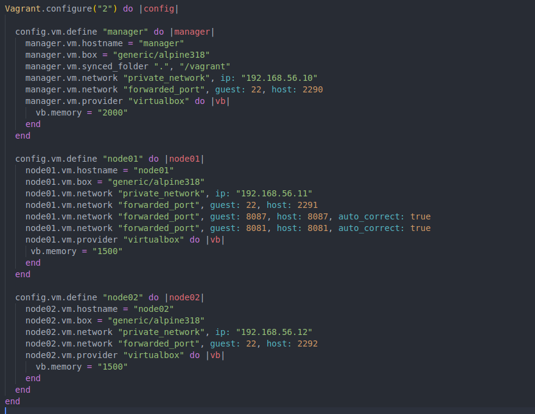
Создаю три виртальные машины: manager, node01, node02. Задаю статические ip адреса, прокидываю необходимые порты

2) Подготовить manager как рабочую станцию для удаленного конфигурирования (помощь по Ansible в материалах).   

- **Решение:**
   - Зайти на manager.
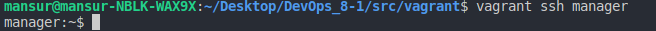                                             
   - На manager проверить подключение к node01 через ssh по приватной сети.
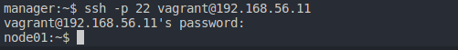  
С manager по ssh подключился к node01
   - Сгенерировать ssh-ключ для подключения к node01 из manager (без passphrase).
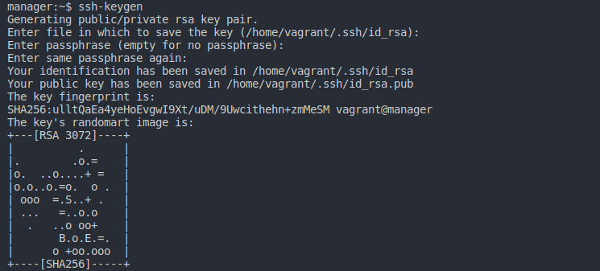 
Далее использовал ssh-copy-id для того, чтобы прокинуть ключи, чтобы не надо было вводить пароль.
- Скопировать на manager docker-compose файл и исходный код микросервисов.
   - 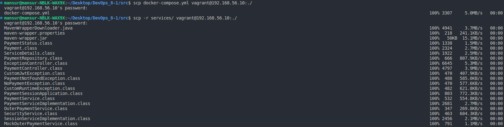 
Скопировал на manager docker-compose file, исходные код микросервисов при помощи утилиты scp
   - Установить Ansible на менеджер и создать папку ansible, в которой создать inventory-файл. 
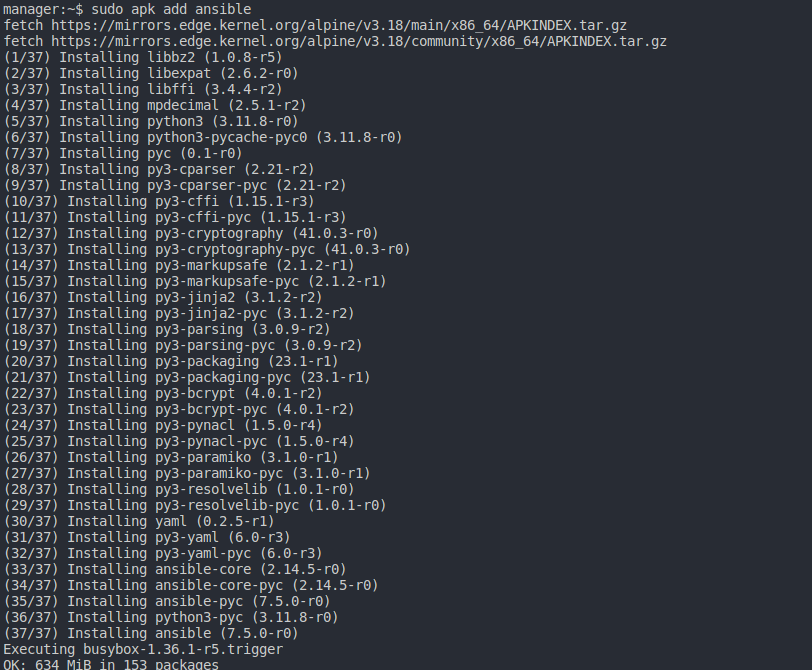
inventory file:
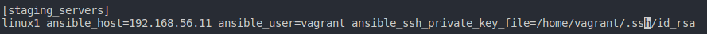
Указал группы хостов, задал имя, указали адрес хоста
   - Использовать модуль ping для проверки подключения через Ansible. 
   Результат выполнения модуля поместить в отчет.
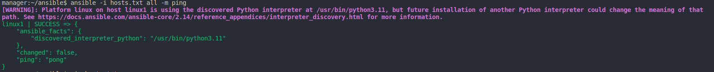 
В результате получаем, что тестовое подключение произошло успешно и версию интепретатора python на хосте.

3) Написать первый плейбук для Ansible, который выполняет apt update, устанавливает docker, docker-compose, копирует compose-файл из manager'а и разворачивает микросервисное приложение. 
- **Решение**  
   - Получившийся playbook: \
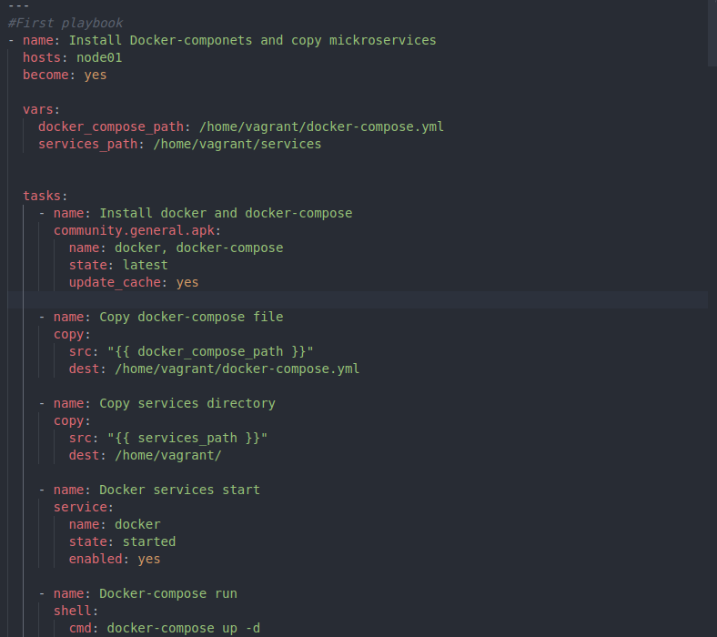 
Созданный playbook состоит:
name - имя playbook, 
hosts - группы хостов, к которому будем применять playbook, become - директива, что последующие задачи будут выполнены с повышением привелегий, 
vars - переменные для tasks, 
tasks - задачаи, которые выполняют некоторую последовательность действий на hosts.

   - Запуск ansible playbook: \
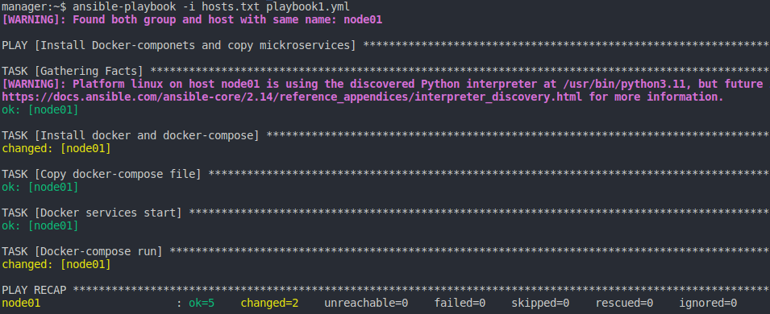
Получаем логи о состоянии tasks, которые исполнял ansible
4) Прогнать заготовленные тесты через postman и удостовериться, что все они проходят успешно. В отчете отобразить результаты тестирования.   
- **Решение:**  
   - Запуск тестов через Postman: \
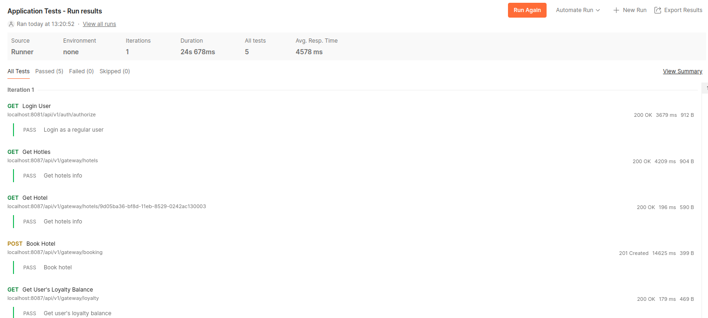
Используя Postman, тестируем приложение через предоставленные тесты. 

5) Сформировать три роли: 
   1. роль application выполняет развертывание микросервисного приложения при помощи docker-compose,
   2. apache устанавливает и запускает стандартный apache сервер
   3. postgres устанавливает и запускает postgres, создает базу данных с произвольной таблицей и добавляет в нее три произвольные записи. 

- Назначить первую роль node01 и вторые две роли node02, проверить postman-тестами работоспособность микросервисного приложения, удостовериться в доступности postgres и apache-сервера.  

-  **Решение:**
   - Playbook, включающий три необходимые роли: application, postgres, apache для хостов node01 и node02. \
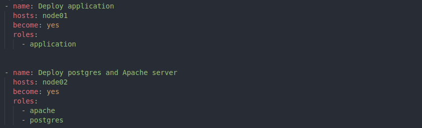
   - tasks для роли apache \
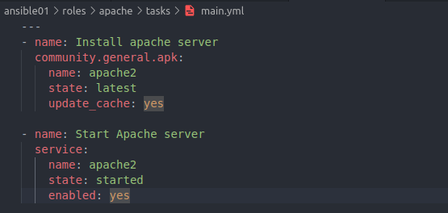
   - tasks для роли application \
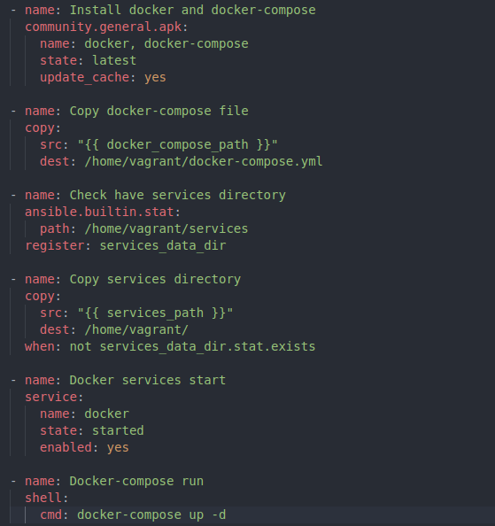
   - vars для роли application \
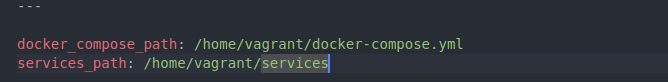
   - tasks для роли postgres \
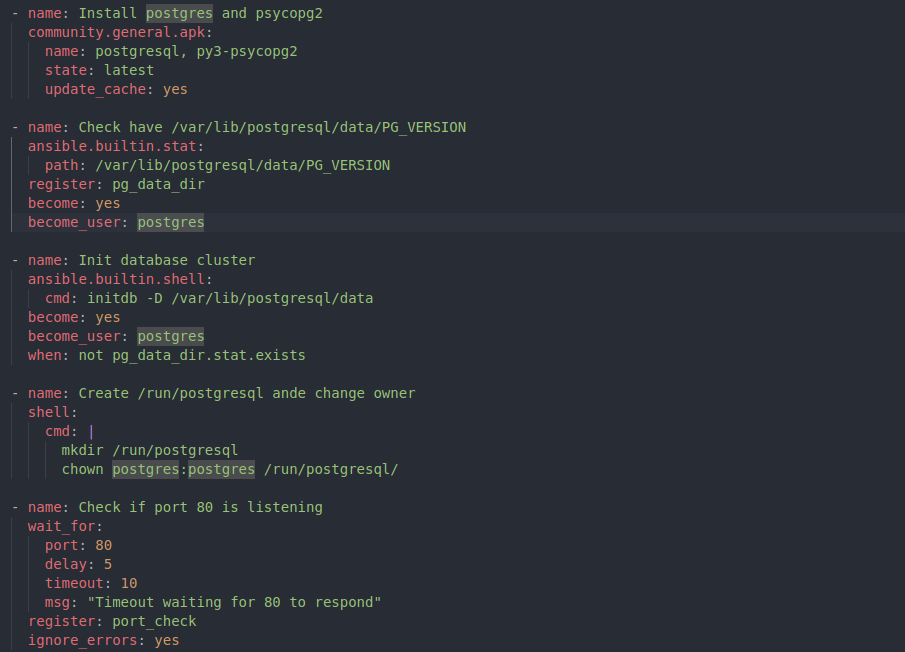
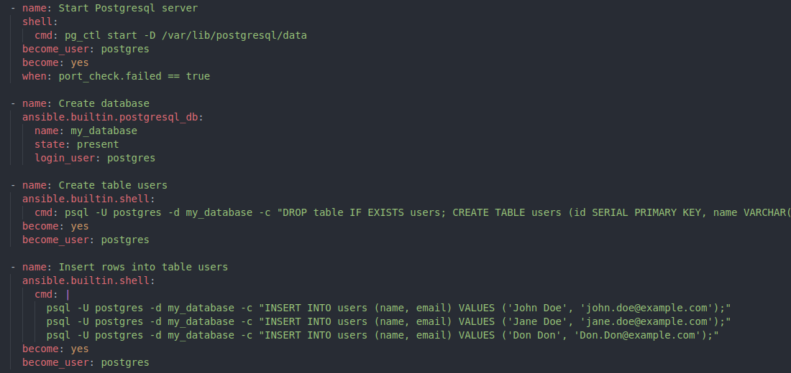

   - Команда и результат выполнения ansible-playbook \

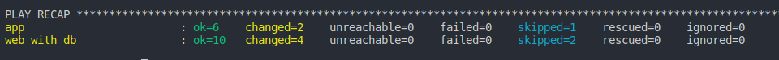
   - Запуск тестов через Postman
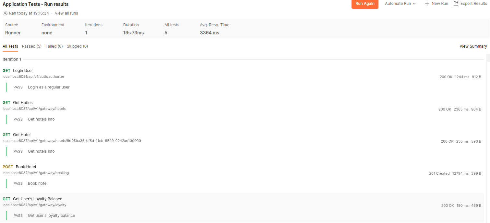 \
   - Проверка, что postgres запущен и таблица существует и имеет записи \
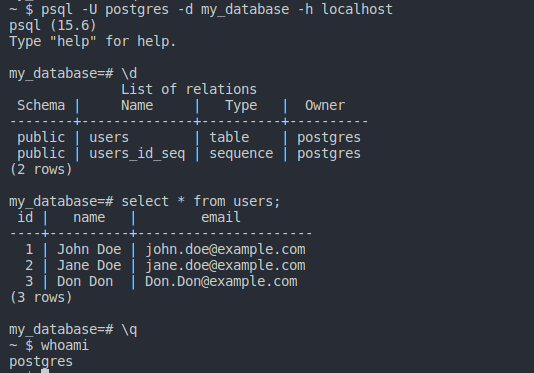
   - Проброс 80 порта node02, на которой запущен apache, на 8080 порт хостовой машине. \
 
6) Созданные в этом разделе файлы разместить в папке `src\ansible01` в личном репозитории.   
**Решение:**
   - Структура проекта \
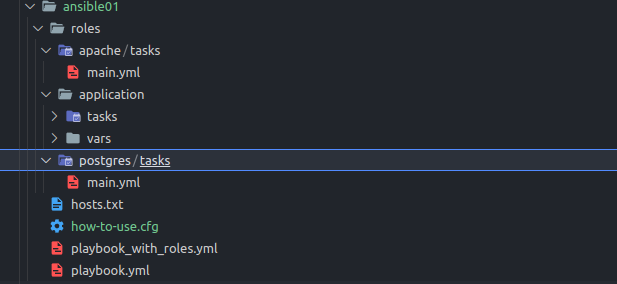

## Part 2. Service Discovery

**== Задание ==**

1) Написать два конфигурационный файла для consul:    
**Решение:**
   - consul_server.hcl: \

   - consul_client.hcl: \
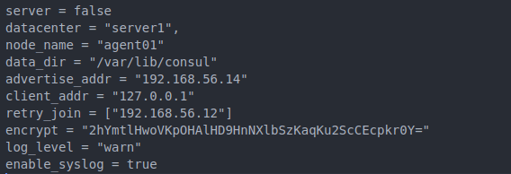

2) Создать с помощью Vagrant четыре машины - manager, consul_server, api и db.   
**Решение:** \
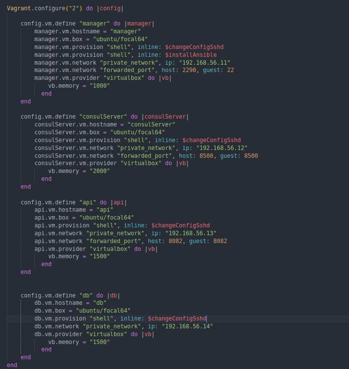 
Vagrantfile состоит из 4 вирутальных машин:
   - manager, которая будет используя ansible будет разворачивать приложения, 
   - consulServer, на которой будет развернут ConsulServer для взаимодествия с агентами, 
   - api, на которой будет запущен агент Consul и java приложение hotel-service
   - db, включающая в себя агент Consul
   - Прокинул порты на соотвествующие машинах
3) Написал плейбук для ansible и четыре роли:   
**Решение**
   - Для работы необходимо иметь бинарный файл Consul версии 1.8.4 в `src/consul01`
   - install_consul_server, которая копирует consul_server.hcl, устанавливает consul и необходимые зависимости, запускает сервис consul: \
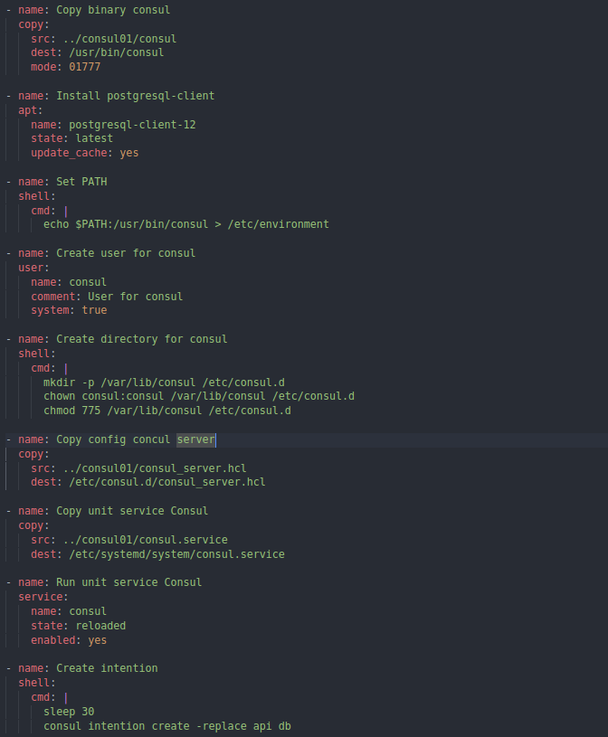
   - install_consul_client, которая:
   Роль для api и db, копирует consul_client.hcl, устанавливает consul и необходимые зависимости, запускает сервис consul: \
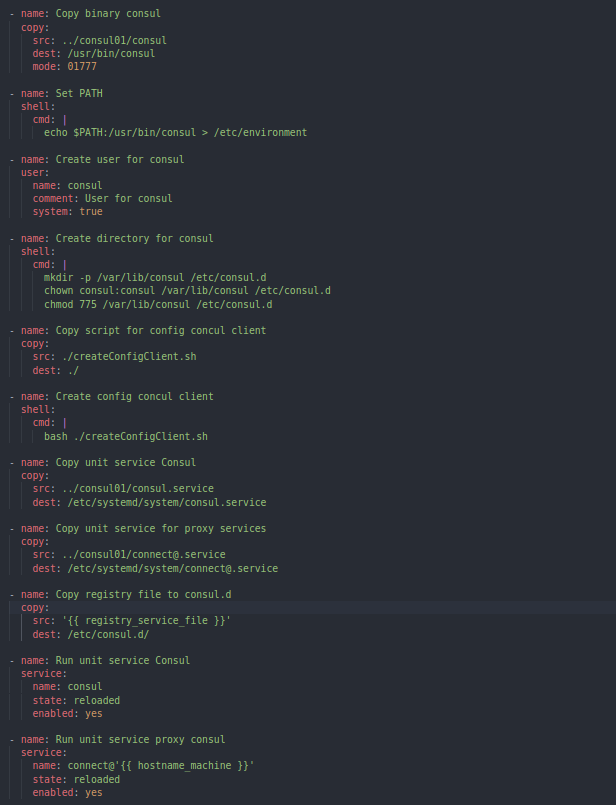   
   - install_db, которая:
    Роль для db, устанавливет postgres и запускает его, а также создает базу данных `hotels_db` \
   
- install_hotels_service, которая:  
   - работает с api;
   - копирует исходный код сервиса
   - устанавлвиает `openjdk-8-jdk`
   - создает глобальные переменные окружения:
      - POSTGRES_HOST="127.0.0.1"
      - POSTGRES_PORT="5432"
      - POSTGRES_DB="hotels_db"
      - POSTGRES_USER="<имя пользователя>"
      - POSTGRES_PASSWORD="<пароль пользователя>"
   - запускает собранный jar-файл командой `java -jar <путь до hotel-service>/hotel-service/target/<имя jar-файла>.jar`
   Роль для api, копирует исходный код сервиса, уставливает устанавлвиает `openjdk-8-jdk` и создает переменные окружения. \
   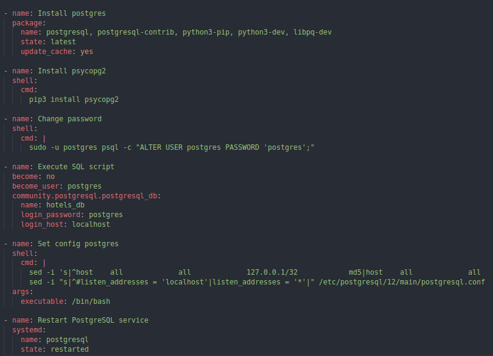
4) Удостоверился в работоспобности сервиса, делая запросы через соотвестующий порт в браузере на хостовой машине.    
**Решение:**
   - Обращение к api сервисов для проверки работоспобности приложения: \
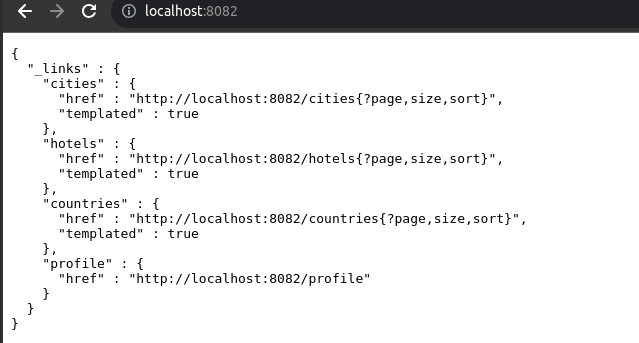
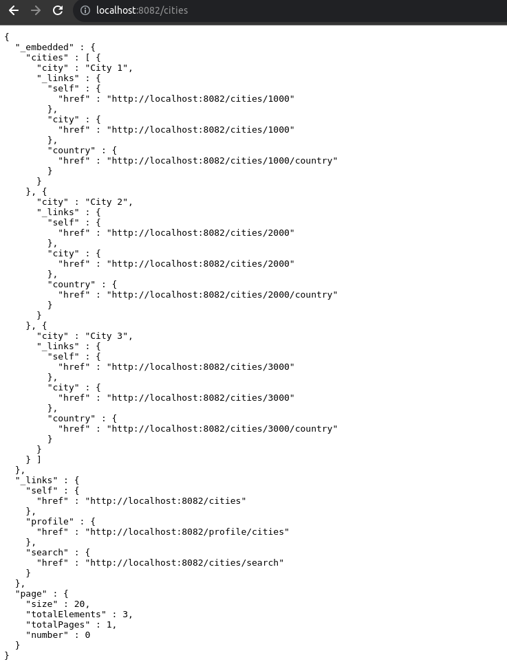
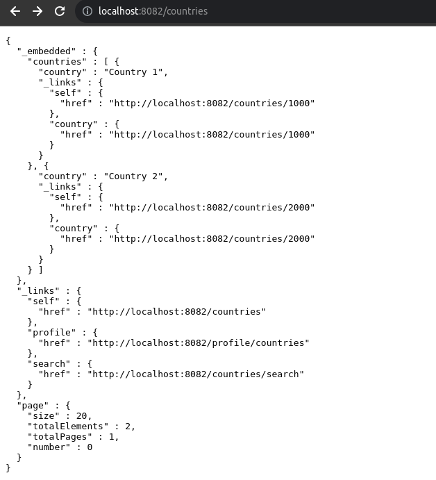

5) Созданные в этом разделе файлы разместить в папках `src\ansible02` и `src\consul01` в личном репозитории. \
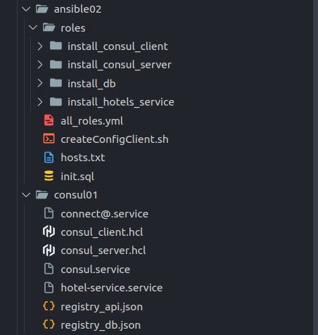

