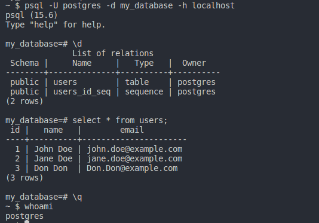
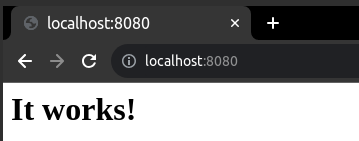

# Инструменты автоматизации

Использование инструментов автоматизации для провизии узлов.

## Contents

1. [Chapter II](#chapter-i) \
   1.1. [Удаленное конфигурирование узла через Ansible](#part-1-удаленное-конфигурирование-узла-через-ansible) \
   1.2. [Service Discovery](#part-2-service-discovery) 

## Chapter I

## Part 1. Удаленное конфигурирование узла через Ansible

1) Создал с помощью Vagrant три машины - manager, node01, node02. Не устанавливать с помощью shell-скриптов docker при создании машин на Vagrant! Прокинуть порты node01 на локальную машину для доступа к пока еще не развернутому микросервисному приложению.  
Решение:                                     
                        
Создаю три виртальные машины: manager, node01, node02. Задаю статические ip адреса, прокидываю необходимые порты

2) Подготовил manager как рабочую станцию для удаленного конфигурирования.
- Зайти на manager.                                                          
                                             
- На manager проверить подключение к node01 через ssh по приватной сети.                                 
                                                 
С manager по ssh подключился к node01
- Сгенерировать ssh-ключ для подключения к node01 из manager (без passphrase).                           
                                                                                                 
Далее использовал ssh-copy-id для того, чтобы прокинуть ключи, чтобы не надо было вводить пароль.
- Скопировать на manager docker-compose файл и исходный код микросервисов.                         
                           
Скопировал на manager docker-compose file, исходные код микросервисов при помощи утилиты scp
- Установить Ansible на менеджер и создать папку ansible, в которой создать inventory-файл.                        
                                                                                                                   
inventory file:                                                        

Указал группы хостов, задал имя, указали адрес хоста
- Использовать модуль ping для проверки подключения через Ansible. 
- Результат выполнения модуля поместить в отчет.
                     
В результате получаем, что тестовое подключение произошло успешно и версию интепретатора python на хосте.

3) Написать первый плейбук для Ansible, который выполняет apt update, устанавливает docker, docker-compose, копирует compose-файл из manager'а и разворачивает микросервисное приложение.    
Получившийся playbook:                          
                                             
Созданный playbook состоит:
name - имя playbook, 
hosts - группы хостов, к которому будем применять playbook, become - директива, что последующие задачи будут выполнены с повышением привелегий, 
vars - переменные для tasks, 
tasks - задачаи, которые выполняют некоторую последовательность действий на hosts.                 
Запуск ansible playbook:                                 
                         
Получаем логи о состоянии tasks
4) Прогнать заготовленные тесты через postman и удостовериться, что все они проходят успешно. В отчете отобразить результаты тестирования.   
Запуск тестов через Postman:
                        
Используя Postman, тестируем приложение через предоставленные тесты. 

5) Сформировал три роли: 

 - Playbook, включающий три необходимые роли: application, postgres, apache для хостов node01 и node02.
                   
- tasks для роли apache                

- tasks для роли application                       
              
- vars для роли application               
                                      
- tasks для роли postgres                             

- Команда и результат выполнения ansible-Playbook                                      

- Запуск тестов через Postman

- Проверка, что postgres запущен и таблица существует и имеет записи                            

- Проброс 80 порта node02, на которой запущен apache, на 8080 порт хостовой машине.                   
 
6) Созданные в этом разделе файлы разместить в папке `src\ansible01` в личном репозитории.                        

## Part 2. Service Discovery

1) Написал два конфигурационный файла для consul (информация по consul в материалах):
- consul_server.hcl:                      

- consul_client.hcl:                      

2) Создал с помощью Vagrant три машины - consul_server, api и db.                              
- Полученный Vagrantfile                             
                      
Vagrantfile состоит из 4 вирутальных машин:
   - manager, которая будет используя ansible будет разворачивать приложения, 
   - consulServer, на которой будет развернут ConsulServer для взаимодествия с агентами, 
   - api, на которой будет запущен агент Consul и java приложение hotel-service
   - db, включающая в себя агент Consul
   - Прокинул порты на соотвествующие машинах
3) Написал плейбук для ansible и четыре роли: 
- install_consul_server, которая
   Роль для consul_server, копирует consul_server.hcl, устанавливает consul и необходимые зависимости, запускает сервис consul:
             
- install_consul_client, которая
   Роль для api и db, копирует consul_client.hcl, устанавливает consul и необходимые зависимости, запускает сервис consul:    
             
- install_db, которая:
    Роль для db, устанавливет postgres и запускает его, а также создает базу данных `hotels_db`    
   
- install_hotels_service - роль для api, копирует исходный код сервиса, уставливает устанавлвиает `openjdk-8-jdk` и создает переменные окружения.  
   
4) Удостоверился в работоспобности сервиса, делая запросы через соотвестующий порт в браузере на хостовой машине.
- Результаты выполнения запросов api:  

5) Структура папок 'ansible02' и 'consul01'                       

